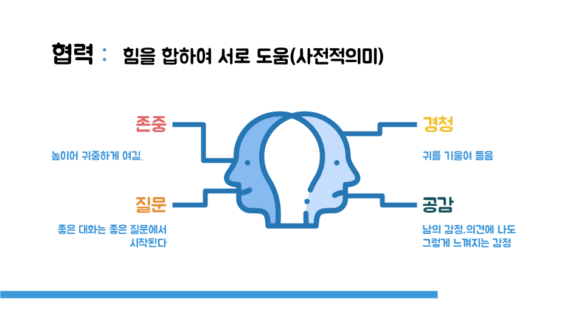
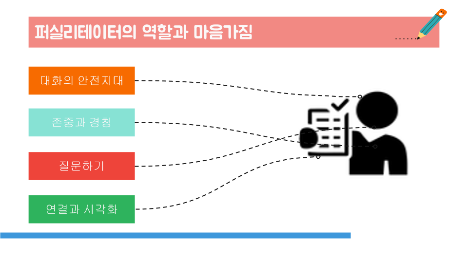

+++
weight = 10
+++

## 내가 알고 있는 퍼실리테이션은? 

* {} 관심이 없음, 진행자, 회의이끄는 사람 {}
* {} 분쟁조정,업무조율,문제해결 {}
* {} 갈등조율,새로운 대안찾기,학습에 참여와 도움을 높임 {}

---

## Facilitation 퍼실리테이션..

```txt
> 퍼실리테이션(facilitation)의 어원을 보면 '쉽게 만든다'는 뜻이다.  
> 퍼실리테이션은 사람들 사이에 소통과 협력 이 활발하게 일어나 시너지가 생기도록 도와주는 행위이고, 
> 이런 일을 하는 사람을 퍼실리테이터(facilitator)라고 한다.
```
<small>{} 💡 **신좌섭 교수/한국퍼실리테이터협회 부회장, 2017** {} </small>

---



## 소통과 협력

* **<span style="color:red">소통</span>** 이란 : 서로 뜻이 통하여 오해가 없음 (사전적의미)
* 상대방의 세계는 당신의 세계와 분명 다르다.

---

## <span style="color:blue">협력</span>



---



---

## 퍼실리테이터의 철학

* 사람은 기본적으로 <span style="color:red;font-size: 40px;" size="5">**현명**</span>하며 올바른 일을 할 수 있으며 또 그렇게 하고 싶어한다. 
* 사람들은 자신이 참여한 <span style="color:red;font-size: 40px;" size="5">**아이디어**</span>나 계획에 대해서는 더욱 <span style="color:blue;font-size: 40px;" size="5">**헌신적**</span>으로 임한다. 
* 사람들은 자신의 결정에 대해 책임이 부여되면 진정으로 <span style="color:red;font-size: 40px;" size="5">**책임감**</span> 있게 행동한다. 
* <span style="color:red;font-size: 40px;" size="5">**모든 사람**</span> 의 의견은 지위, 계급의 여하를 막론하고 <span style="color:blue;font-size: 40px;" size="5">**똑같이 소중**</span>하다. 