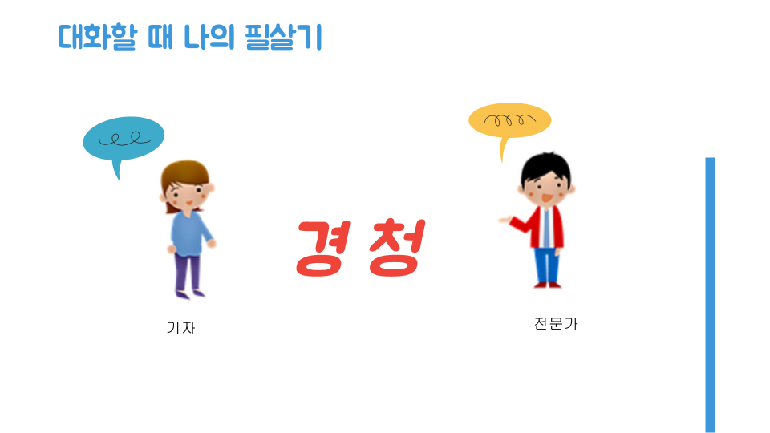

+++
weight = 20
+++

{}

# 경청의 5가지 도구

 
<small>아래 화살표를 누르시면 경청의 5가지를 하나씩 확인하실 수 있습니다.</small>
 
<a href="#" class="navigate-down">🔽</a>

--- 

### 1. 판단 보다는 **`공감`** 할 준비를 해야 합니다.

> 상대방에 대한 편견과 선입견을 버리고 충고 하고 싶고 해답을 이야기하고 싶은 마음을 접어두고 그냥 들어주세요 

<small>경청의 두번째 도구는?</small>
 
<a href="#" class="navigate-down">🔽</a>

--- 

### 2. 상대방을 **`인정`** 해야 합니다.

> 상대방의 말과 행동에 집중하여 이야기를 듣고 상대방은 소중한 존재임을 인식한다.  
> 상대방의 진정한 마음의 소리를 들을 수 있다.  

<small>경청의 세번째 도구는?</small>
 
<a href="#" class="navigate-down">🔽</a>

--- 

### 3. 말하기를 **`절제`** 해야 합니다.

> 상대방에게 나를 이해시키는 욕구를 자제합니다.

<small>경청의 네번째 도구는?</small>
 
<a href="#" class="navigate-down">🔽</a>

--- 

### 4. 겸손하게 **`이해`** 해야 합니다.

> 상대방의 감정에 겸손하게 듣는 넓은 마음을 가집니다. 

<small>경청의 마지막 도구는?</small>
 
<a href="#" class="navigate-down">🔽</a>

--- 

### 5. 온몸으로 **`응답`** 해야 합니다.

> 경청은 몸으로만 하는 것이 아닌 눈빛, 몸짓, 추임새 등으로 표현할 수 있습니다.

<small>결론은?</small>
 
<a href="#" class="navigate-down">🔽</a>

---

{}