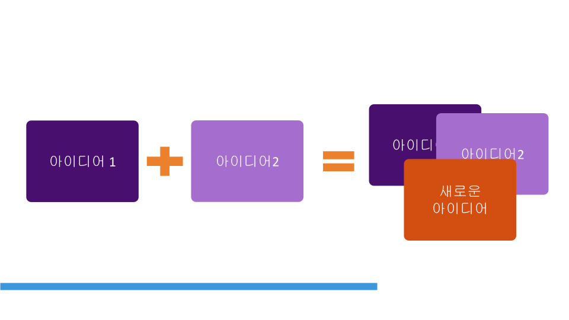

+++
weight = 30
+++

### 친구와 대화 경험 나누기

* 짝토론 : 기자와 전문가로 나누어서 15분씩 나눠서 나만의 소통(대화) 노하우를 나눠주세요

```text
가이드 질문 : 
다른사람과의 대화 중에 즐거운 대화의경험이 있다면 나눠주세요. 

그때 기분은 어떠셨나요? 
대화할 때 걸림돌이 무엇이었나요? (이렇게 대화했더니 대화가 잘 안 풀렸다)
어떻게 해결하셨나요?
어떤 배움이 있었나요?
```

---

### 관점의 다양화

> **우리의 아이디어를 더하고 다듬어서  
> `더 나은 아이디어` 로 만들 수 있다.** 

---



---

# 내가 <span style="color:blue;">`중요`</span>하게 생각하는 
# <span style="color:red;">가치</span>는 무엇인가요?